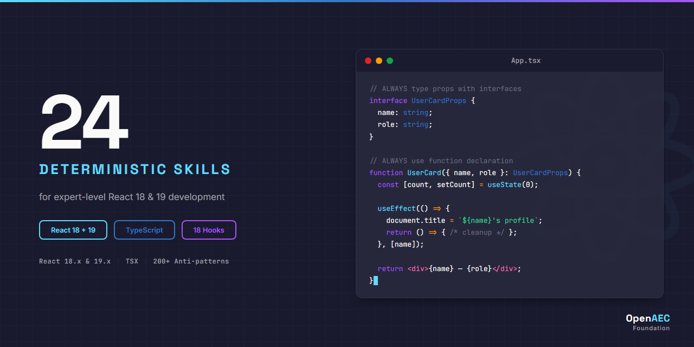

# React Claude Skill Package

<p align="center">
  
</p>

<div align="center">

**24 deterministic skills for React 18 & 19 development with Claude**

[](https://opensource.org/licenses/MIT)
[](https://react.dev)
[](https://www.typescriptlang.org/)
[](INDEX.md)
[](https://github.com/OpenAEC-Foundation)

</div>

---

## What is this?

This repository contains **24 production-ready Claude skills** that teach [Claude](https://claude.ai) how to write, review, debug, and architect React applications with expert-level precision.

Each skill is a structured knowledge file that Claude loads contextually — giving it deep understanding of React hooks, component patterns, Server Components, concurrent features, and the React 19 Compiler. All skills use **deterministic language** (ALWAYS/NEVER) and **TypeScript/TSX** code examples verified against [react.dev](https://react.dev).

## Skill Catalog

### Core (3 skills)
| Skill | What it covers |
|-------|---------------|
| [`react-core-architecture`](skills/source/react-core/react-core-architecture/SKILL.md) | Virtual DOM, fiber, reconciliation, rendering phases, component lifecycle |
| [`react-core-state`](skills/source/react-core/react-core-state/SKILL.md) | useState vs useReducer, lifting state, Context, Zustand, TanStack Query |
| [`react-core-concurrent`](skills/source/react-core/react-core-concurrent/SKILL.md) | Suspense, transitions, deferred values, code splitting, streaming SSR |

### Syntax (8 skills)
| Skill | What it covers |
|-------|---------------|
| [`react-syntax-hooks-basic`](skills/source/react-syntax/react-syntax-hooks-basic/SKILL.md) | useState, useEffect, useContext, useRef, useMemo, useCallback, useReducer |
| [`react-syntax-hooks-advanced`](skills/source/react-syntax/react-syntax-hooks-advanced/SKILL.md) | useId, useTransition, useDeferredValue + React 19: use(), useActionState, useOptimistic |
| [`react-syntax-jsx`](skills/source/react-syntax/react-syntax-jsx/SKILL.md) | JSX expressions, conditional rendering, lists/keys, fragments, TypeScript generics |
| [`react-syntax-components`](skills/source/react-syntax/react-syntax-components/SKILL.md) | Props, memo, forwardRef, lazy, portals, compound components, render props |
| [`react-syntax-events`](skills/source/react-syntax/react-syntax-events/SKILL.md) | Synthetic events, TypeScript event types, handler patterns, delegation |
| [`react-syntax-context`](skills/source/react-syntax/react-syntax-context/SKILL.md) | createContext, useContext, Provider, performance optimization |
| [`react-syntax-refs`](skills/source/react-syntax/react-syntax-refs/SKILL.md) | useRef, forwardRef, useImperativeHandle, callback refs, React 19 ref-as-prop |
| [`react-syntax-forms`](skills/source/react-syntax/react-syntax-forms/SKILL.md) | Controlled/uncontrolled, React 19 form actions, useFormStatus, useActionState |

### Implementation (7 skills)
| Skill | What it covers |
|-------|---------------|
| [`react-impl-project-setup`](skills/source/react-impl/react-impl-project-setup/SKILL.md) | Vite + React + TypeScript, project structure, ESLint, env vars |
| [`react-impl-testing`](skills/source/react-impl/react-impl-testing/SKILL.md) | React Testing Library + Vitest, queries, user-event, renderHook |
| [`react-impl-performance`](skills/source/react-impl/react-impl-performance/SKILL.md) | React.memo, Profiler, React Compiler, code splitting, virtualization |
| [`react-impl-styling`](skills/source/react-impl/react-impl-styling/SKILL.md) | CSS Modules, Tailwind CSS, className patterns, dark mode |
| [`react-impl-server-components`](skills/source/react-impl/react-impl-server-components/SKILL.md) | Server/Client Components, directives, Server Actions, serialization |
| [`react-impl-routing`](skills/source/react-impl/react-impl-routing/SKILL.md) | React Router v6+, createBrowserRouter, loaders, actions, lazy routes |
| [`react-impl-data-fetching`](skills/source/react-impl/react-impl-data-fetching/SKILL.md) | TanStack Query, useQuery, useMutation, Suspense, caching |

### Errors (4 skills)
| Skill | What it covers |
|-------|---------------|
| [`react-errors-boundaries`](skills/source/react-errors/react-errors-boundaries/SKILL.md) | Error boundaries, getDerivedStateFromError, recovery patterns |
| [`react-errors-hooks`](skills/source/react-errors/react-errors-hooks/SKILL.md) | Rules of Hooks violations, stale closures, infinite loops |
| [`react-errors-hydration`](skills/source/react-errors/react-errors-hydration/SKILL.md) | SSR hydration mismatches, debugging, React 19 improvements |
| [`react-errors-debugging`](skills/source/react-errors/react-errors-debugging/SKILL.md) | React DevTools, Strict Mode, console warnings, error messages |

### Agents (2 skills)
| Skill | What it covers |
|-------|---------------|
| [`react-agents-review`](skills/source/react-agents/react-agents-review/SKILL.md) | Code review checklist: hooks, TypeScript, performance, accessibility |
| [`react-agents-project-scaffolder`](skills/source/react-agents/react-agents-project-scaffolder/SKILL.md) | Project generation: Vite config, structure, routing, state, testing |

## How to Use

### With Claude Code
```bash
# Clone this repository
git clone https://github.com/OpenAEC-Foundation/React-Claude-Skill-Package.git

# Add the skills directory to your project's .claude/settings.json
# or reference skills directly in your CLAUDE.md
```

### With Claude Projects
1. Upload the skills you need to your Claude project
2. Claude will automatically apply the skill knowledge to your React queries

### Skill Structure
Each skill follows a consistent format:
```
skills/source/react-{category}/react-{category}-{topic}/
├── SKILL.md              # Main skill file (<500 lines)
└── references/
    ├── examples.md       # Extended code examples
    ├── api-table.md      # API reference tables
    ├── patterns.md       # Architecture patterns
    └── anti-patterns.md  # What NOT to do
```

## Quality Standards

- **Deterministic language**: ALWAYS/NEVER, not "you might consider"
- **TypeScript/TSX**: All code examples include proper type annotations
- **React 18 + 19**: Dual version coverage with version badges
- **Verified**: All content checked against [react.dev](https://react.dev)
- **Concise**: Every SKILL.md is under 500 lines
- **200+ anti-patterns**: Each skill documents what NOT to do and WHY

## Methodology

This package follows the **7-phase research-first methodology** proven in:
- [ERPNext Skill Package](https://github.com/OpenAEC-Foundation/ERPNext_Anthropic_Claude_Development_Skill_Package) (28 skills)
- [Tauri 2 Skill Package](https://github.com/OpenAEC-Foundation/Tauri-2-Claude-Skill-Package) (27 skills)
- [Blender-Bonsai Skill Package](https://github.com/OpenAEC-Foundation/Blender-Bonsai-ifcOpenshell-Sverchok-Claude-Skill-Package) (73 skills)

## Repository Structure

```
├── CLAUDE.md              # Project protocols and instructions
├── INDEX.md               # Complete skill catalog with links
├── ROADMAP.md             # Status and progress tracking
├── REQUIREMENTS.md        # Quality guarantees
├── DECISIONS.md           # Architectural decisions
├── SOURCES.md             # Official reference URLs
├── docs/
│   ├── masterplan/        # Execution plan (24 skills, 8 batches)
│   └── research/          # Vooronderzoek + research fragments
└── skills/
    └── source/
        ├── react-core/    # Architecture, state, concurrent (3)
        ├── react-syntax/  # Hooks, JSX, components, events (8)
        ├── react-impl/    # Testing, performance, SSR, routing (7)
        ├── react-errors/  # Boundaries, debugging, hydration (4)
        └── react-agents/  # Review, scaffolding (2)
```

## License

[MIT](LICENSE) — OpenAEC Foundation, 2026
